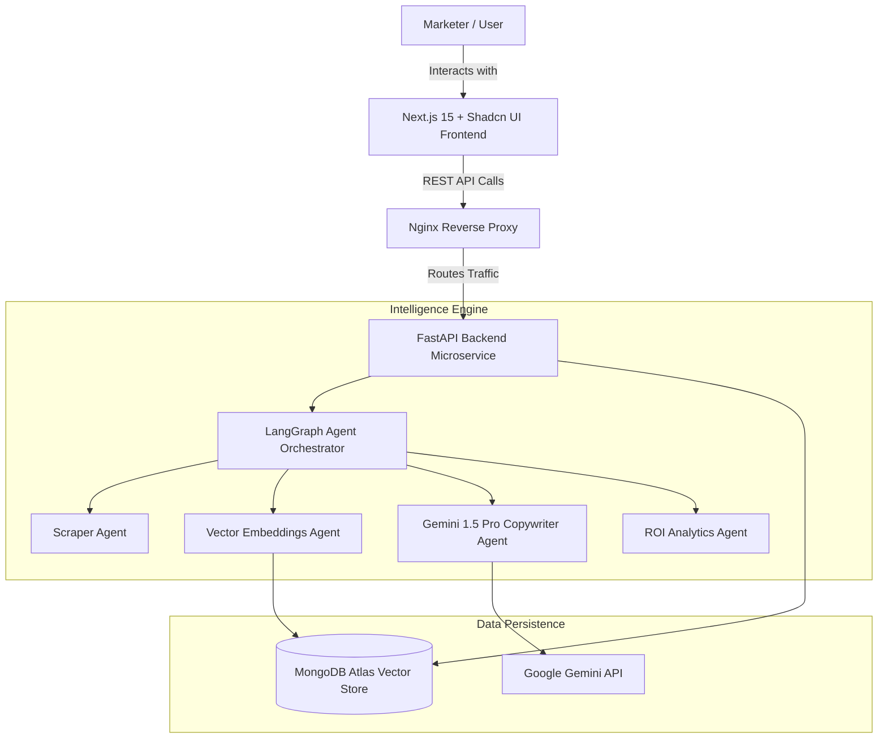

# PainToAd AI 🚀
### Transforming Real Customer Conversations into High-Converting AI Marketing Campaigns

> **AI for Marketers Hackathon Submission** | Developed by **Compass Crew**

[](https://nextjs.org/)
[](https://fastapi.tiangolo.com/)
[](https://ai.google.dev/)
[](https://www.mongodb.com/atlas)
[](https://www.docker.com/)
[](LICENSE)

---

## 📌 Project Overview

**PainToAd AI** is an autonomous Marketing Intelligence Platform that solves the biggest challenge in modern digital advertising: **Writing ad copy that resonates deeply with real customer pain points.**

Traditional ad tools generate generic headlines. **PainToAd AI** scrapes organic public discussions (Reddit, X, G2, ProductHunt, forums), analyzes emotional intensity, clusters key customer pain vectors using semantic embeddings (`sentence-transformers/all-MiniLM-L6-v2`), and orchestrates multi-agent AI workflows (LangGraph + Google Gemini 1.5 Pro) to generate platform-native ad campaigns complete with predictive CTR and ROI conversion math.

---

## ✨ Key Features

- 🕷️ **Autonomous Customer Discussion Scraping**: Crawls public forums and reviews to collect real user frustrations in real-time.
- 🧠 **Vector Pain Point Intelligence**: Clusters customer complaints using 384-dimensional dense vector embeddings and emotional frustration scoring.
- 🎯 **Multi-Platform Ad Generation**: Generates targeted, high-converting ad copy for Meta (Facebook & Instagram), Google Search, LinkedIn Ads, and TikTok.
- 📈 **Predictive ROI Analytics**: Calculates projected Click-Through-Rate (CTR), Conversion Rate, Cost Per Acquisition (CPA), and Net ROI multipliers.
- ⚡ **Modern Glassmorphic Dashboard**: Real-time interactive UI built with Next.js 15, Tailwind CSS, and Shadcn UI components.
- 🐳 **Enterprise Production Deployment**: Fully containerized with Docker, Nginx reverse proxy, Vercel frontend edge network, and Render backend execution.

---

## 🏗️ Architecture



---

## 🛠️ Tech Stack

| Domain | Technology / Library |
| :--- | :--- |
| **Frontend Framework** | Next.js 15 (App Router, Server Components) |
| **UI Library** | Tailwind CSS, Shadcn UI, Radix UI, Lucide Icons |
| **State & Query** | React 19, TanStack Query v5 |
| **Backend Framework** | FastAPI (Python 3.11+), Uvicorn ASGI |
| **Database** | MongoDB Atlas (Document Store & Vector Search) |
| **AI Models & Agents** | Google Gemini 1.5 Pro, LangGraph, Sentence Transformers |
| **Containerization** | Docker, Docker Compose, Nginx Alpine |
| **Deployment** | Vercel (Frontend), Render (Backend) |

---

## 📁 Folder Structure

```
ai-for-marketers-hackathon-compass-crew/
├── backend/
│   ├── api/                # FastAPI Route Controllers & Endpoints
│   ├── config/             # Pydantic Settings & Environment Configurations
│   │   ├── __init__.py
│   │   └── settings.py
│   ├── database/           # MongoDB Connection, ODM Models & Pydantic Schemas
│   ├── scraper/            # Web Scraper & Forum Data Collectors
│   ├── ai/                 # LangGraph Multi-Agent Workflows & Gemini Prompts
│   ├── utils/              # Security, Logger, & ROI Math Helpers
│   │   ├── __init__.py
│   │   ├── helpers.py
│   │   ├── logger.py
│   │   └── security.py
│   ├── main.py             # FastAPI App Entrypoint
│   └── requirements.txt    # Backend Dependencies
├── frontend/               # Next.js 15 App Router Codebase
├── docs/                   # System Documentation
│   ├── architecture.md
│   ├── workflow.md
│   ├── api_docs.md
│   ├── database.md
│   └── deployment.md
├── deployment/             # DevOps & Container Configurations
│   ├── Dockerfile.backend
│   ├── Dockerfile.frontend
│   ├── docker-compose.yml
│   ├── nginx.conf
│   └── vercel.json
├── README.md               # Project Master Documentation
├── CONTRIBUTING.md         # Contribution Guidelines
└── LICENSE                 # Open Source MIT License
```

---

## ⚡ Installation & Local Setup

### Prerequisites
- Node.js 20+ & npm
- Python 3.11+
- MongoDB Atlas Account (or local MongoDB 7.0)
- Google Gemini API Key

### 1. Clone Repository
```bash
git clone https://github.com/HackIndiaXYZ/ai-for-marketers-hackathon-compass-crew.git
cd ai-for-marketers-hackathon-compass-crew
```

### 2. Configure Backend Environment
Create `backend/.env` file:
```ini
ENVIRONMENT=development
DEBUG=True
PORT=8000
MONGODB_URL=mongodb+srv://<username>:<password>@cluster.mongodb.net/?retryWrites=true&w=majority
DATABASE_NAME=pain_to_ad_ai_db
GEMINI_API_KEY=your_google_gemini_api_key_here
SECRET_KEY=super_secret_jwt_key_hackathon_2026
```

### 3. Run Backend (FastAPI)
```bash
cd backend
python -m venv venv
# On Windows:
venv\Scripts\activate
# On Linux/macOS:
source venv/bin/activate

pip install -r requirements.txt
uvicorn backend.main:app --reload --port 8000
```
Backend Swagger API Docs will be available at: `http://localhost:8000/docs`

### 4. Run via Docker Compose (Recommended)
```bash
docker-compose -f deployment/docker-compose.yml up --build
```
Access the application at `http://localhost:3000`.

---

## 🔌 API Overview

Detailed interactive OpenAPI documentation is available via `/docs`. Key endpoints include:

- `GET  /api/v1/health` - Backend Operational Health Check
- `POST /api/v1/auth/login` - User Authentication & Token Issuance
- `POST /api/v1/intelligence/scrape` - Scrapes Customer Discussion Data
- `POST /api/v1/campaigns/generate` - Generates Multi-Platform Ad Variations with Gemini 1.5 Pro
- `POST /api/v1/analytics/predict` - Calculates ROI & Click-Through Predictions

*For complete payload schemas and sample responses, see [`docs/api_docs.md`](docs/api_docs.md).*

---

## 🚢 Deployment Steps

### Quick Deploy (Render + Vercel)
1. **Backend**: Connect GitHub repo to Render, select `deployment/Dockerfile.backend`, and configure environment variables.
2. **Frontend**: Import `frontend/` directory to Vercel, add `NEXT_PUBLIC_API_BASE_URL`, and deploy.

*For full deployment checklists and configurations, view [`docs/deployment.md`](docs/deployment.md).*

---

## 👥 Contributors

Developed with ❤️ for the **AI for Marketers Hackathon** by **Compass Crew**:

- **Kamal Solanki** - *Team Lead & System Architect / DevOps Engineer*
- **Compass Crew AI Team** - *Frontend & Multi-Agent Engineers*

---

## 🚀 Future Scope

- [ ] **Direct Ad Platform Integrations**: One-click campaign deployment directly to Meta Ad Manager & Google Ads API.
- [ ] **A/B Testing Simulator**: Real-time multi-arm bandit algorithms for optimizing creative variations.
- [ ] **Multi-Modal Ad Generation**: Auto-generation of video scripts and graphic asset prompts via Imagen 3.

---

## 📄 License

Distributed under the MIT License. See [`LICENSE`](LICENSE) for more details.
