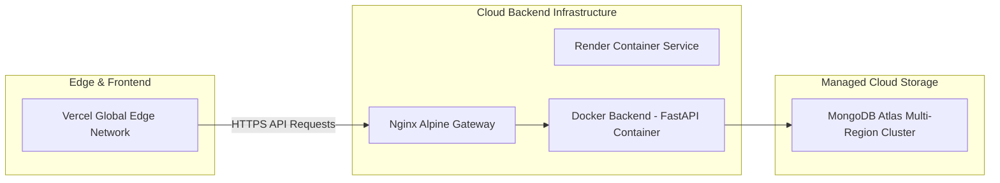

# PainToAd AI - Enterprise System Architecture Document

## 1. Executive Summary & Architecture Overview

**PainToAd AI** is an enterprise-grade AI-powered Marketing Intelligence Platform engineered for the **AI for Marketers Hackathon**. The platform bridges the gap between unstructured real-world customer discussions (Reddit, X, Quora, G2, ProductHunt) and high-converting marketing campaigns.

By synthesizing real-time data scraping, vector embeddings, multi-agent AI workflows (LangGraph + Google Gemini API), and predictive conversion scoring, PainToAd AI enables marketing teams to turn raw customer pain points into tailored, ROI-optimized ad creative across Google Ads, Meta Ads, LinkedIn Ads, and TikTok.

---

## 2. End-to-End System Architecture

```mermaid
graph TD
    subgraph Client Layer (Vercel Edge Network)
        UI[Next.js 15 App Router Frontend]
        State[React State & Query Client]
        Shadcn[Shadcn UI + Tailwind CSS]
        UI --> State
        UI --> Shadcn
    end

    subgraph API Gateway & Reverse Proxy
        Nginx[Nginx Reverse Proxy / Load Balancer]
    end

    subgraph Backend Application Layer (Render Container Platform)
        FastAPI[FastAPI Asynchronous Gateway]
        Middleware[CORS, Auth, & Rate-Limiting Middleware]
        Controllers[API Route Controllers]

        FastAPI --> Middleware
        Middleware --> Controllers
    end

    subgraph AI & Orchestration Engine (LangGraph + Gemini)
        AgentOrchestrator[LangGraph Multi-Agent Orchestrator]
        ScraperAgent[Data Collector & Scraper Agent]
        AnalysisAgent[Pain Point & Intelligence Agent]
        CopywriterAgent[Ad Copy Generation Agent]
        PredictionAgent[ROI & Predictive Analytics Agent]

        AgentOrchestrator --> ScraperAgent
        AgentOrchestrator --> AnalysisAgent
        AgentOrchestrator --> CopywriterAgent
        AgentOrchestrator --> PredictionAgent
    end

    subgraph Data & Vector Layer (MongoDB Atlas + Sentence Transformers)
        Mongo[(MongoDB Atlas Cluster)]
        VectorDB[Vector Search Index - 384d]
        SentenceTransformers[Sentence Transformers / all-MiniLM-L6-v2]
    end

    UI <-->|HTTPS / JSON REST API| Nginx
    Nginx <-->|Forward Proxied Calls| FastAPI
    Controllers <--> AgentOrchestrator
    ScraperAgent <-->|Public API Scraping| WebSources[Reddit / X / G2 / Forums]
    AnalysisAgent <-->|Embeddings & Similarity| SentenceTransformers
    CopywriterAgent <-->|Prompt Generation & Tuning| GeminiAPI[Google Gemini 1.5 Pro API]
    PredictionAgent <-->|Historical Conversion Models| Mongo
    SentenceTransformers <--> VectorDB
    Controllers <--> Mongo
```

---

## 3. Frontend Architecture

The frontend is constructed using modern web standards for speed, accessibility, and visual appeal:

- **Framework**: Next.js 15 (App Router with React 19 Server Components)
- **Language**: TypeScript for strict end-to-end type safety
- **Styling**: Tailwind CSS with custom HSL color systems, glassmorphic themes, dark mode support
- **UI Components**: Shadcn UI primitives built on Radix UI
- **State & Data Fetching**: TanStack Query (React Query v5) for cache synchronization, optimistic updates, and loading states
- **Visualization**: Recharts & Lucide React for ROI prediction dashboards and sentiment distribution charts

---

## 4. Backend Architecture

The backend is built as a high-performance, asynchronous RESTful microservice:

- **Framework**: FastAPI (Python 3.11+) utilizing Uvicorn ASGI server
- **Design Pattern**: Modular Clean Architecture separating `api`, `config`, `database`, `ai`, `scraper`, and `utils`
- **Security**: JWT-based Authentication, CORS policies, rate limiting, and inputs validated via Pydantic v2 schemas
- **Asynchronous Execution**: Native `async/await` non-blocking processing for external scraping and Gemini API interactions

---

## 5. AI Agent & LLM Layer

The core intelligence layer leverages state-of-the-art generative AI and vector embeddings:

1. **Multi-Agent Flow (LangGraph)**:
   - State-machine driven workflows coordinating specialized agents.
   - Fault-tolerant fallback execution paths if scrapers or LLM APIs encounter rate limits.
2. **Google Gemini API (`gemini-1.5-pro`)**:
   - Advanced zero-shot and few-shot prompt templates engineered for emotional hook creation, pain-to-feature mapping, and platform-specific ad formats (Google Search, Meta Reels, LinkedIn Sponsored Content).
3. **Semantic Vector Space (`sentence-transformers/all-MiniLM-L6-v2`)**:
   - Converts raw customer discussions into 384-dimensional dense vectors stored in MongoDB Atlas Vector Search.
   - Enables cosine-similarity clustering to identify recurring pain point clusters.

---

## 6. Database & Storage Architecture

- **Primary Database**: MongoDB Atlas (Cloud Hosted fully managed Document Store)
- **Collections**:
  - `users`: User profiles, subscription tier, and auth credentials.
  - `scraped_raw_data`: Unstructured customer comments, posts, metadata.
  - `pain_points`: Structured customer insights, sentiment scores, and 384d vector embeddings.
  - `campaigns`: Generated ad copy variants, platform targetings, and CTAs.
  - `analytics_reports`: Predicted CTR, Conversion Rate, CPC, and ROI score breakdowns.
- **Indexing Strategy**: Text indexes for keyword discovery, Compound indexes on `(user_id, created_at)`, and Vector Indexing for cosine similarity queries.

---

## 7. Deployment & Infrastructure Architecture



- **Frontend Deployment**: Deployed on Vercel Global Edge Network with automated GitHub CI/CD deployments.
- **Backend Deployment**: Containerized with Docker and hosted on Render Cloud Engine behind an Nginx Reverse Proxy.
- **SSL/TLS**: End-to-end encryption enforced via Vercel Edge SSL and Render SSL termination.
