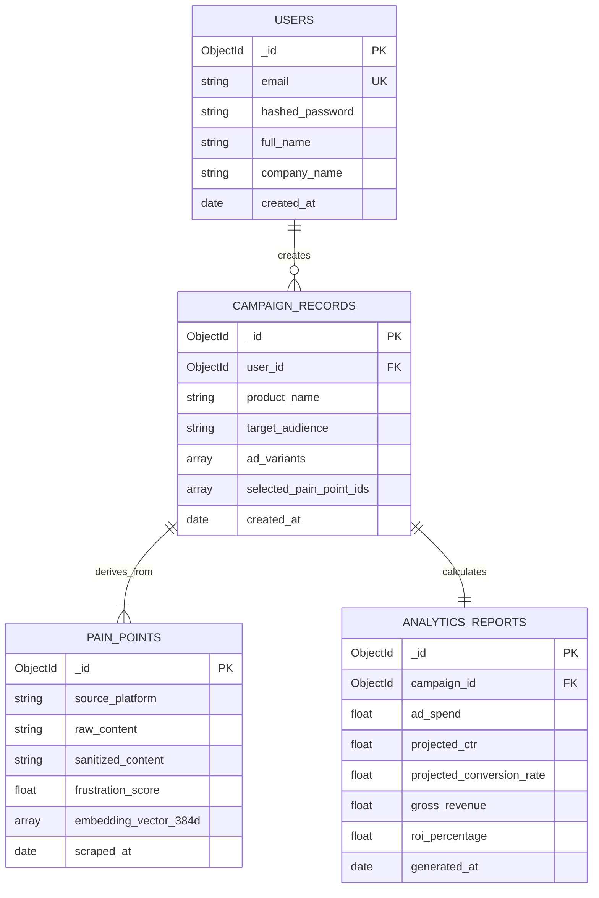

# PainToAd AI - MongoDB Atlas Database Architecture

## 1. Database Overview

PainToAd AI utilizes **MongoDB Atlas** as its document database. The schema is designed for high scalability, supporting un-structured text scraped from public forums, dense vector embedding arrays for semantic clustering, and rich campaign analytics payloads.

---

## 2. Collection Schemas & Entity Relationships



---

## 3. MongoDB Collections Breakdown

### 3.1 `users` Collection
Stores user profiles and authentication details.

```json
{
  "_id": {"$oid": "66a4b1c2e4b0a1a2b3c4d5e6"},
  "email": "user@marketer.com",
  "hashed_password": "$2b$12$EixZaYVK1fsbw1ZfbX3OXePaWxn96p36WQoeG6Lruj3vjPGga31lW",
  "full_name": "Alex Mercer",
  "company_name": "Growth Matrix",
  "created_at": {"$date": "2026-07-27T10:00:00.000Z"}
}
```

### 3.2 `pain_points` Collection
Stores extracted customer feedback, sentiment ratings, and dense vector embeddings.

```json
{
  "_id": {"$oid": "66a4b2d3e4b0a1a2b3c4d5e7"},
  "source_platform": "Reddit",
  "raw_content": "Why is it so painful to migrate billing data from Stripe to paddle?",
  "sanitized_content": "Why is it so painful to migrate billing data from Stripe to paddle?",
  "niche_category": "SaaS Billing Migration",
  "frustration_score": 9.2,
  "embedding_vector_384d": [0.0245, -0.1123, 0.5432, "...384 dimensions..."],
  "scraped_at": {"$date": "2026-07-27T10:05:00.000Z"}
}
```

### 3.3 `campaigns` Collection
Stores AI-generated ad copy and platform targeting strategies.

```json
{
  "_id": {"$oid": "66a4b3e4e4b0a1a2b3c4d5e8"},
  "user_id": {"$oid": "66a4b1c2e4b0a1a2b3c4d5e6"},
  "product_name": "PayMigrate AI",
  "target_audience": "Fintech Developers & CFOs",
  "ad_variants": [
    {
      "platform": "LinkedIn",
      "headline": "Zero-Downtime Stripe to Paddle Migration",
      "primary_text": "Don't break your recurring revenue streams during billing migrations.",
      "cta": "Request Early Access"
    }
  ],
  "created_at": {"$date": "2026-07-27T10:10:00.000Z"}
}
```

### 3.4 `analytics_reports` Collection
Stores predictive campaign ROI analysis and conversion models.

```json
{
  "_id": {"$oid": "66a4b4f5e4b0a1a2b3c4d5e9"},
  "campaign_id": {"$oid": "66a4b3e4e4b0a1a2b3c4d5e8"},
  "ad_spend": 2500.00,
  "projected_ctr": 3.8,
  "projected_conversion_rate": 4.5,
  "estimated_clicks": 2850,
  "estimated_conversions": 128,
  "gross_revenue": 25600.00,
  "roi_percentage": 924.0,
  "generated_at": {"$date": "2026-07-27T10:12:00.000Z"}
}
```

---

## 4. Indexing & Vector Search Optimization

### Standard Indexes
```javascript
// Index on Users email for O(1) auth lookup
db.users.createIndex({ "email": 1 }, { unique: true });

// Compound Index on Campaigns for fast dashboard filtering
db.campaigns.createIndex({ "user_id": 1, "created_at": -1 });

// Text Index on Pain Points for full-text search
db.pain_points.createIndex({ "sanitized_content": "text", "niche_category": "text" });
```

### MongoDB Atlas Vector Search Definition
```json
{
  "mappings": {
    "dynamic": false,
    "fields": {
      "embedding_vector_384d": {
        "dimensions": 384,
        "similarity": "cosine",
        "type": "knnVector"
      }
    }
  }
}
```
