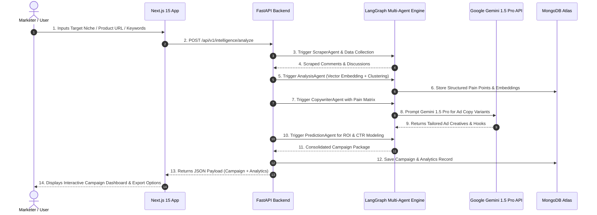
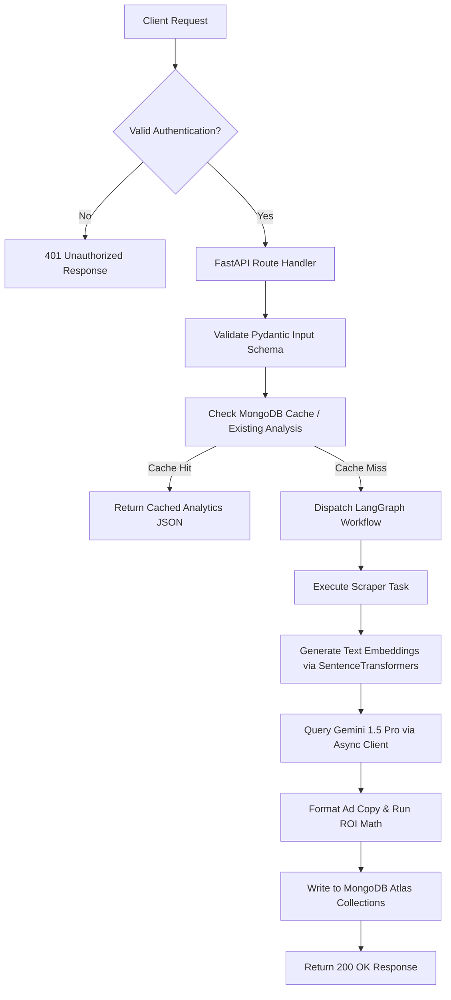
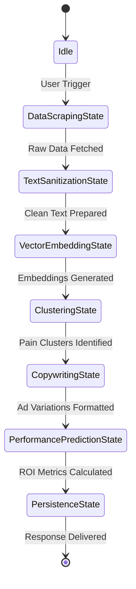

# PainToAd AI - System Workflow & Execution Lifecycles

## 1. Complete User Workflow

---

## 2. Detailed User Flow Description

1. **Campaign Initialization**:
   - The user navigates to the PainToAd AI Dashboard.
   - User submits product details, target audience criteria (e.g., "SaaS founders frustrated with churn"), and target platform preferences (Meta, Google, LinkedIn).
2. **Data Collection & Crawling**:
   - PainToAd AI automatically scans public discussions across Reddit subreddits, X threads, G2 reviews, and community forums for target keywords.
3. **Pain Point Intelligence**:
   - Raw data is filtered, sanitized, and clustered into actionable pain point vectors.
   - Emotional intensity, frustration scores, and urgency markers are computed.
4. **AI Campaign Generation**:
   - LangGraph orchestrates the generation of multi-platform ad variations:
     - **Headline**: High-converting hook addressing the exact pain point phrasing.
     - **Primary Text**: Problem-Agitate-Solution (PAS) or Attention-Interest-Desire-Action (AIDA) frameworks.
     - **Call to Action**: High-intent conversion trigger.
5. **Predictive Performance Analytics**:
   - Simulated CTR, projected conversion rate, estimated CPC, and ROI multiplier are calculated based on benchmark metrics.
6. **Campaign Export & Deployment**:
   - Marketers can review, edit, copy, or export ad campaigns in CSV/JSON formats or push directly to ad channels.

---

## 3. End-to-End System & Request Lifecycle

---

## 4. LangGraph Multi-Agent Flow State Diagram

